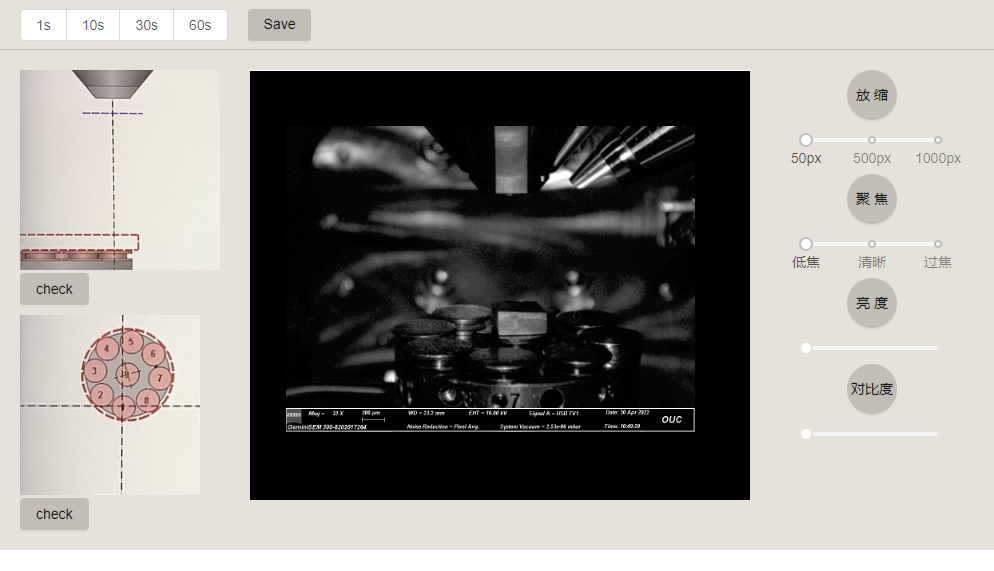

## electron-microscope-teaching-app

> electron@19.0.9

[ant-design-vue](https://www.antdv.com/components/overview-cn/)

[vue 组件间通信](https://blog.csdn.net/qq_38211443/article/details/122852703)

[vue css 简单动画](https://blog.csdn.net/weixin_42349568/article/details/122359703)

[StackBlur.js做图片背景模糊](https://blog.csdn.net/xiao_bin_shen/article/details/109000151)

[viewerjs](https://github.com/fengyuanchen/viewerjs)

[v-viewerjs](https://github.com/mirari/v-viewer)

## snapshot




## Project setup
```
yarn install
```

### Compiles and hot-reloads for development
```
yarn electron:serve
```

### Compiles and minifies for production
```
yarn electron:build
```

### Lints and fixes files
```
yarn lint
```

### Customize configuration
See [Configuration Reference](https://cli.vuejs.org/config/).
